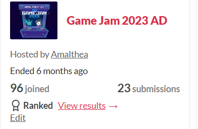
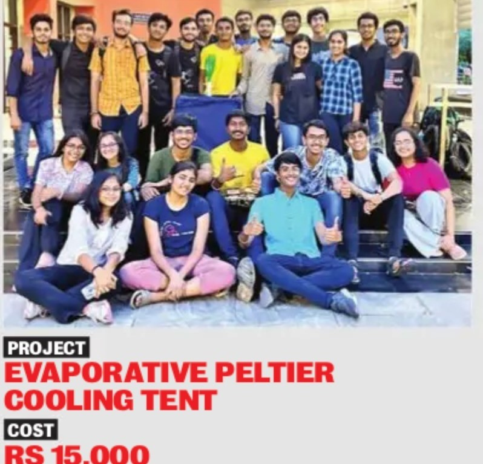


-----

## Senior Executive, Events and Events Management, Amalthea’23
_IIT Gandhinagar, Aug '23 - Oct '23_

  

    
<strong>Event Lead for GameJam’23</strong>: A global-scale event attracting participants from Malaysia, Italy, Indonesia, and more.

    
<strong>Organized Game Development Workshop</strong>: Attracted 500+ participants from top institutes, promoting game development culture.

    
<strong>Contributed to Events Management</strong>: Ensured smooth logistics, accommodations, and hospitality for a seamless experience.

  

  

    
  

---

## Team Lead of Group of 30
_IIT Gandhinagar, May '23 - Jul '23_

  

    
  

  

    
<strong>Led a diverse team of 30 individuals</strong>: Optimized their full potential through strategic work allocation and fostering a collaborative and healthy work environment.

    
<strong>Project Planning and Management</strong>: Acquired hands-on experience in project planning, resource allocation, and problem resolution, contributing to a successful outcome in addressing heatstroke prevention.

  

---
